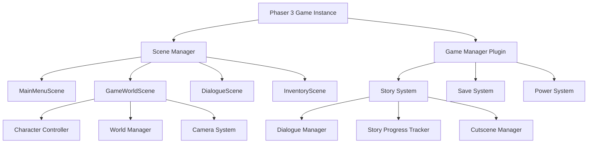

# Design Document

## Overview

The top-down web RPG will be built using Phaser 3, a mature HTML5 game framework that provides robust 2D game development capabilities. The game follows a story-driven design where narrative progression unlocks new powers and areas. The architecture leverages Phaser's scene system and plugin architecture for modularity, allowing for easy content updates and story expansion.

The game will feature a 2D top-down perspective with sprite-based graphics, focusing on atmospheric storytelling rather than complex combat mechanics. Phaser 3's cross-browser compatibility and performance optimizations ensure smooth gameplay across different web browsers and devices.

## Architecture

### High-Level Architecture



### Technology Stack

**Recommended Game Engine Options:**

1. **Phaser 3** (Recommended for Web)
   - Mature HTML5 game framework with excellent 2D support
   - Built-in scene management, sprite handling, and input systems
   - Strong community and extensive documentation
   - Perfect for story-driven 2D games

2. **Godot Engine** (Alternative for Cross-Platform)
   - Free, open-source engine with excellent 2D capabilities
   - Built-in scripting with GDScript or C#
   - Can export to web (HTML5) and other platforms
   - Great for indie story-focused games

3. **Unity 2D** (Enterprise Option)
   - Professional engine with robust 2D tools
   - WebGL export for web deployment
   - Extensive asset store and community resources

**Selected Stack: Phaser 3**
- **Game Engine**: Phaser 3.70+
- **Language**: JavaScript/TypeScript
- **Audio**: Phaser's built-in audio system
- **Storage**: Phaser's data manager with LocalStorage
- **Asset Management**: Phaser's loader system
- **Build Tools**: Vite or Webpack for bundling

## Components and Interfaces

### Phaser 3 Scene Structure

```javascript
class GameScene extends Phaser.Scene {
  constructor()
  preload() // Asset loading
  create()  // Scene initialization
  update(time, delta) // Game loop
}

class MainMenuScene extends Phaser.Scene
class GameWorldScene extends Phaser.Scene
class DialogueScene extends Phaser.Scene
class InventoryScene extends Phaser.Scene
```

Phaser 3's scene system provides natural separation of game states (menu, gameplay, dialogue, etc.) with built-in lifecycle management.

### Game Manager (Phaser Plugin)

```javascript
class GameManager extends Phaser.Plugins.BasePlugin {
  constructor(pluginManager)
  init()
  start()
  saveGame()
  loadGame()
  getGameState()
}
```

Custom plugin that manages overall game state, save/load functionality, and coordinates between different scenes. Leverages Phaser's plugin system for clean integration.

### Story System

```javascript
class StorySystem {
  constructor()
  loadStoryData(storyFile)
  triggerStoryEvent(eventId)
  checkStoryConditions(conditionSet)
  unlockPower(powerId)
  progressStory(checkpointId)
}
```

Central narrative controller that manages story progression, dialogue trees, cutscenes, and power unlocking. Uses a data-driven approach with JSON story definitions.

### Character Controller

```javascript
class Character {
  constructor(spriteData)
  move(direction, speed)
  interact(target)
  usePower(powerId)
  updateAnimation(deltaTime)
}
```

Manages the main character's movement, animations, interactions, and power usage. Handles collision detection and world interaction.

### Power System

```javascript
class PowerSystem {
  constructor()
  unlockPower(powerId, storyTrigger)
  activatePower(powerId, context)
  checkPowerAvailability(powerId)
  getPowerList()
}
```

Manages character powers that unlock through story progression. Each power has specific activation conditions and effects on gameplay or story.

## Data Models

### Game State Model

```javascript
const GameState = {
  player: {
    position: { x: Number, y: Number },
    health: Number,
    currentArea: String,
    facingDirection: String
  },
  story: {
    currentCheckpoint: String,
    completedEvents: Array<String>,
    unlockedPowers: Array<String>,
    storyFlags: Object
  },
  inventory: {
    items: Array<Item>,
    maxCapacity: Number
  },
  world: {
    currentMap: String,
    visitedAreas: Array<String>
  }
}
```

### Story Event Model

```javascript
const StoryEvent = {
  id: String,
  type: 'dialogue' | 'cutscene' | 'power_unlock' | 'area_unlock',
  triggers: Array<Condition>,
  content: {
    text: String,
    speaker: String,
    choices: Array<Choice>,
    powerUnlock: String,
    nextEvent: String
  }
}
```

### Power Model

```javascript
const Power = {
  id: String,
  name: String,
  description: String,
  unlockCondition: String,
  type: 'passive' | 'active' | 'story',
  effects: Array<Effect>,
  cooldown: Number
}
```

### Map Model

```javascript
const GameMap = {
  id: String,
  name: String,
  dimensions: { width: Number, height: Number },
  tileSize: Number,
  layers: Array<TileLayer>,
  objects: Array<GameObject>,
  spawnPoint: { x: Number, y: Number },
  connections: Array<MapConnection>
}
```

## Error Handling

### Save System Error Handling

- **LocalStorage Full**: Implement save data compression and cleanup of old saves
- **Corrupted Save Data**: Validate save data structure and provide fallback to last known good state
- **Browser Compatibility**: Graceful degradation for browsers with limited storage support

### Asset Loading Error Handling

- **Missing Assets**: Provide placeholder graphics and continue gameplay
- **Network Issues**: Implement retry logic with exponential backoff
- **Invalid Asset Format**: Log errors and use fallback assets

### Story System Error Handling

- **Missing Story Data**: Provide default dialogue and prevent game breaking
- **Invalid Story Conditions**: Log warnings and continue with default behavior
- **Circular Story Dependencies**: Detect and resolve during story data validation

## Testing Strategy

### Unit Testing

- **Core Systems**: Test game engine, story system, and power system logic
- **Data Models**: Validate save/load functionality and data integrity
- **Utility Functions**: Test collision detection, pathfinding, and mathematical operations

### Integration Testing

- **Story Flow**: Test complete story paths and power unlock sequences
- **Save/Load**: Verify game state persistence across browser sessions
- **Cross-Browser**: Test on major browsers (Chrome, Firefox, Safari, Edge)

### User Experience Testing

- **Story Pacing**: Validate narrative flow and player engagement
- **Control Responsiveness**: Test input handling across different devices
- **Performance**: Monitor frame rate and memory usage during extended play

### Automated Testing

```javascript
// Example test structure
describe('StorySystem', () => {
  test('unlocks power when story condition is met', () => {
    const storySystem = new StorySystem();
    storySystem.triggerStoryEvent('first_power_unlock');
    expect(storySystem.checkPowerAvailability('telekinesis')).toBe(true);
  });
});
```

### Manual Testing Scenarios

1. **New Player Experience**: Complete first-time player flow from start to first power unlock
2. **Save/Resume**: Test saving at various story points and resuming correctly
3. **Story Branching**: Verify different dialogue choices lead to appropriate outcomes
4. **Power Usage**: Test each power in various contexts and story situations
5. **Inventory Management**: Test item collection, usage, and inventory limits

The testing strategy ensures both technical functionality and narrative coherence, maintaining the story-focused experience while preventing technical issues that could break immersion.